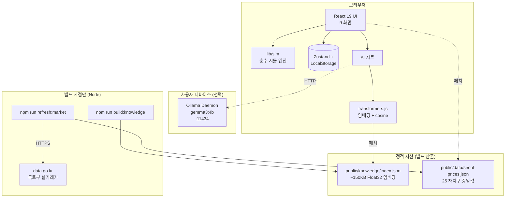
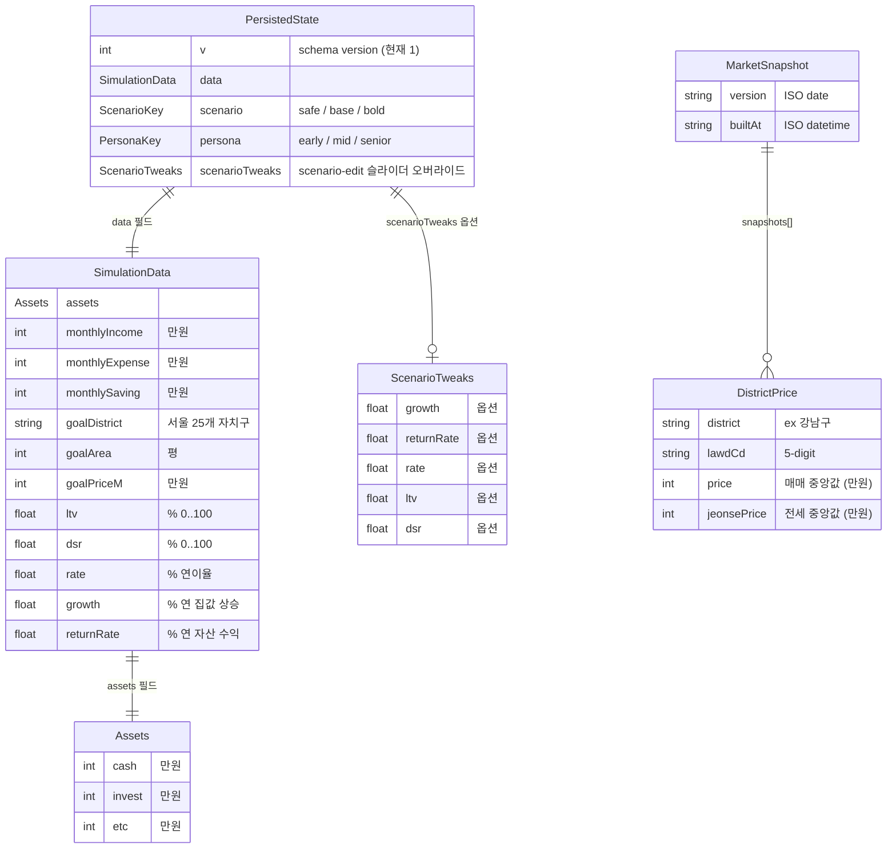
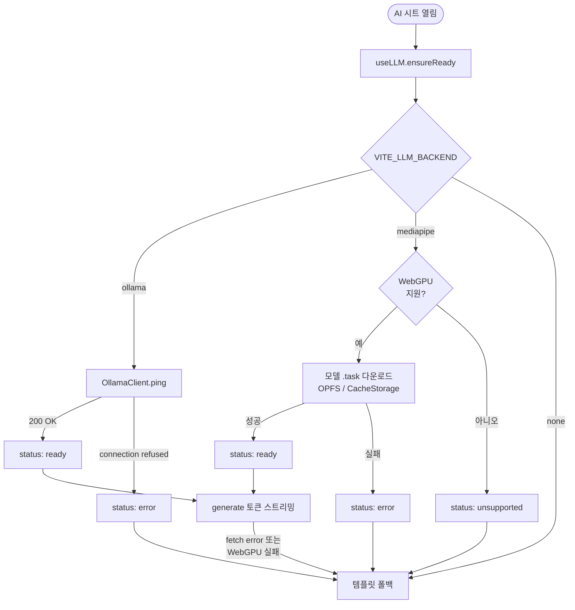

# InSeoul

서울 아파트 구매 가능 시점을 240개월 시뮬레이션으로 보여주는 **Local-First**
부동산 플래닝 웹앱. 사용자 재무 데이터는 *전부 브라우저에 머무르며*, AI
어드바이저는 로컬 Ollama 데몬 또는 브라우저 내 MediaPipe Web LLM 으로 동작한다.

---

## 1. 프로젝트 개요

### 무엇을 푸는가
"내가 지금 자산·소득·저축으로 서울 어디 몇 평을 언제쯤 살 수 있나?" — 이
질문을 외부 서비스에 데이터를 보내지 않고 답한다. 시나리오(안정/기준/적극)
별로 자산 성장과 집값 상승을 동시에 시뮬레이션해 진입 시점·월 상환액·DSR
부담을 함께 보여준다.

### 핵심 원칙
- **Local-First** — *사용자 재무 데이터* (자산·소득·저축액·목표가) 는 어떤
  외부 서버로도 전송되지 않음. 입력은 LocalStorage 에서만 산다.
- **No Sign-up / No Login**
- **On-device AI** — *추론은 모두 사용자 디바이스 내부* (Ollama 로컬 데몬 또는
  브라우저 WebGPU). OpenAI·Anthropic 같은 호스팅 LLM 서비스는 호출하지 않음.
- **Real Data** — 국토교통부 실거래가 (data.go.kr 15126474) 기반 자치구별 중앙값.

> ⚠️ **조건부 동작 — 정직하게**
> "외부 통신 0건" 이 *언제 깨지는가* 를 명시한다. 사용자 재무 데이터가 외부로
> 나가는 일은 어떤 경로에서도 없지만, 다음 *읽기 전용 다운로드* 는 발생할 수
> 있다.
> - **mediapipe 백엔드 활성화 시**: 최초 1회 MediaPipe WASM (jsdelivr CDN) +
>   모델 파일 (`VITE_GEMMA_MODEL_URL` 호스트) 다운로드. 이후 OPFS/CacheStorage 캐시.
> - **AI 시트 첫 사용 시** (모든 백엔드): `@xenova/transformers` 가 RAG 쿼리
>   임베딩용 384차원 MiniLM 모델 (~50MB) 을 HuggingFace 에서 가져옴. 이후 브라우저 캐시.
> - **ollama 백엔드 + 비-로컬 호스트**: `VITE_OLLAMA_URL` 이 localhost 가 아니면
>   사용자 입력이 해당 서버로 *전송*된다. 이 경우 AI 시트 배지가 "⚠️ 원격 LLM 사용 중"
>   (주황) 으로 자동 전환되어 노출된다 (`isLocalLlmHost()` 화이트리스트 가드).
> - **빌드 시점**: `npm run refresh:market` 은 data.go.kr 을 호출하고,
>   `npm run build:knowledge` 는 transformers.js 모델을 받는다. 둘 다 Node 전용,
>   사용자 디바이스와 무관.

### 9개 화면 흐름
welcome → wizard(5 step) → result → {golden, action, risk, calc, stepping,
scenario-edit} + AI 어드바이저 시트.

---

## 2. 시스템 아키텍처

### 단일 호스트, 무서버
백엔드가 없다. 모든 로직(시뮬레이션·RAG·LLM)은 브라우저 또는 사용자
디바이스에서 돌고, *사용자 재무 데이터를 외부로 송신하는 채널은 0개*. 다만
다음의 *읽기 전용* 외부 통신이 발생할 수 있다:

1. **정적 자산 페치** — 같은 호스트의 `public/knowledge/index.json` (빌드 타임에
   사전 계산된 RAG 인덱스), `public/data/seoul-prices.json` (실거래가 스냅샷)
2. **transformers.js 모델 다운로드** (HuggingFace, 최초 1회) — RAG 쿼리 임베딩용
3. **MediaPipe 런타임 + 모델** (jsdelivr CDN + `VITE_GEMMA_MODEL_URL`) — `mediapipe`
   백엔드 활성화 시
4. **로컬 Ollama 데몬** (`localhost:11434`, 사용자가 직접 실행) — `ollama` 백엔드 활성화 시

### 레이어
- `src/lib/sim/` — 순수 함수 (PMT, 자산 성장, 시나리오 보정). React 의존 X.
- `src/store/` — Zustand 단일 스토어 + zod 검증 영구 envelope.
- `src/data/` — 자치구 25개 데이터 + 실거래 스냅샷 lazy 로더.
- `src/screens/` + `src/components/` — UI. iOS 26 디자인 시스템.
- `src/ai/` — RAG 검색 + 프롬프트 빌더 + LLM dispatcher (백엔드 분기).
- `src/types/contracts.ts` — 도메인 타입 단일 출처.

### 검증 게이트
- 시뮬 패리티: 3 페르소나 × 3 시나리오 = 9 스냅샷 (`lib/sim/__tests__/simulate.snap.test.ts`)
- 클라이언트 시크릿 가드: 빌드 후 `dist/` 에 `DATA_GO_KR_KEY` 흔적 0건
- e2e 프라이버시: 페이지 로드 시 third-party 네트워크 호출 0건
- 70 단위 테스트 + 10 Playwright e2e (chromium)

---

## 3. 영구 저장 스키마 (LocalStorage)

진짜 DB 는 없다. 사용자 데이터는 **LocalStorage 단일 키** (`inseoul-local-state`) 에
versioned JSON envelope 로 직렬화된다. 시장 데이터는 별도 *읽기 전용 스냅샷* 으로
서빙된다.

- `PersistedState` 는 zod 스키마로 load 시점에 검증. 깨졌으면 silent null 폴백.
- `MarketSnapshot` 은 빌드 시점에 `npm run refresh:market` 으로 생성되는 *정적
  자산* — 사용자 기기에 쓰이지 않음. 미존재 시 `DISTRICT_PRICE_25` 기본값 사용.
- 영구화는 300ms debounce. `lastResult` 의 series 배열은 저장 X (재계산 < 5ms).

---

## 4. 온디바이스 LLM 시나리오

`VITE_LLM_BACKEND` 값에 따라 3 가지 백엔드로 분기. *어느 경우든 외부 LLM 서비스
(OpenAI, Anthropic 등) 는 호출되지 않음*.

| 백엔드 | 추론 위치 | 모델 | 트리거 |
|---|---|---|---|
| `ollama` | 로컬 데몬 (`:11434`) | `gemma3:4b` (3.3GB) | `VITE_LLM_BACKEND=ollama` |
| `mediapipe` | 브라우저 내 (WebGPU) | Gemma 2B IT 4-bit (.task, ~1.3GB) | `VITE_LLM_BACKEND=mediapipe` + `VITE_GEMMA_MODEL_URL` |
| `none` | — | — | 미설정 또는 명시적 `none` |

### 분기 로직

### 폴백 안전망
- 어느 단계든 실패 → `src/ai/fallback/templates.ts::templateAnswerFor()` 의
  결정적 한국어 답변 사용. UI 는 "🟠 템플릿 모드" 배지 표시.
- `useAdvisor` 가 `llmState.status !== 'ready'` 분기에서 폴백 자동 처리.

### 프라이버시 가드 (Ollama 백엔드)
- `VITE_OLLAMA_URL` 호스트가 *로컬 아님* (localhost / 127.0.0.1 / [::1] / 0.0.0.0
  외) 이면 배지가 **"⚠️ 원격 LLM 사용 중"** (주황 톤) 으로 전환.
- `isLocalLlmHost()` 단위 테스트 8개로 화이트리스트 검증.

### RAG 동작
- 6개 한국어 마크다운 (`src/knowledge/docs/`) → 청크 18개 → 384차원 임베딩
  (`Xenova/paraphrase-multilingual-MiniLM-L12-v2`).
- 사용자 질문 임베딩 → cosine top-4 + 키워드 부스트.
- "추천/매수/예측" 키워드 감지 시 `risk_disclaimer.md#권유 금지` 강제 포함.

---

## 빠른 시작
1. `npm install`
2. `cp .env.example .env.local` 후 키 채우기:
   - `DATA_GO_KR_KEY` (Node 전용, 실거래가 batch 용 — 공공데이터포털 발급)
   - `VITE_LLM_BACKEND=ollama` 권장 + `ollama pull gemma3:4b`
3. `npm run build:knowledge` (RAG 인덱스 1회 빌드)
4. `npm run refresh:market` (실거래가 스냅샷, optional)
5. `npm run dev` → http://localhost:5173/

## 스크립트
- `npm run dev` / `npm run build` / `npm run preview`
- `npm run lint`
- `npm test` (Vitest 단위 70개)
- `npm run e2e` (Playwright 10개 — 사전 `npx playwright install chromium` 필요)
- `npm run build:knowledge` — `src/knowledge/docs/*.md` → `public/knowledge/index.json`
- `npm run refresh:market` — data.go.kr 호출 → `public/data/seoul-prices.json`

## 라이선스 / 데이터 출처
- 코드: 미정 (저장소 visibility 에 따라 별도 결정)
- 실거래가: 국토교통부 / 공공데이터포털 15126474, 재배포 정책 준수
- 폰트: Pretendard (SIL OFL 1.1)
