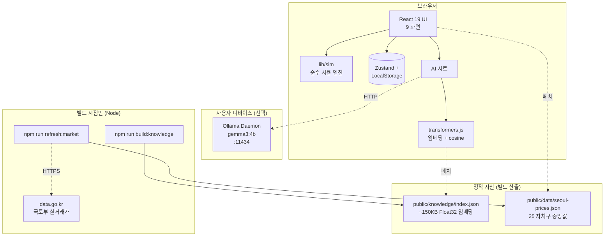
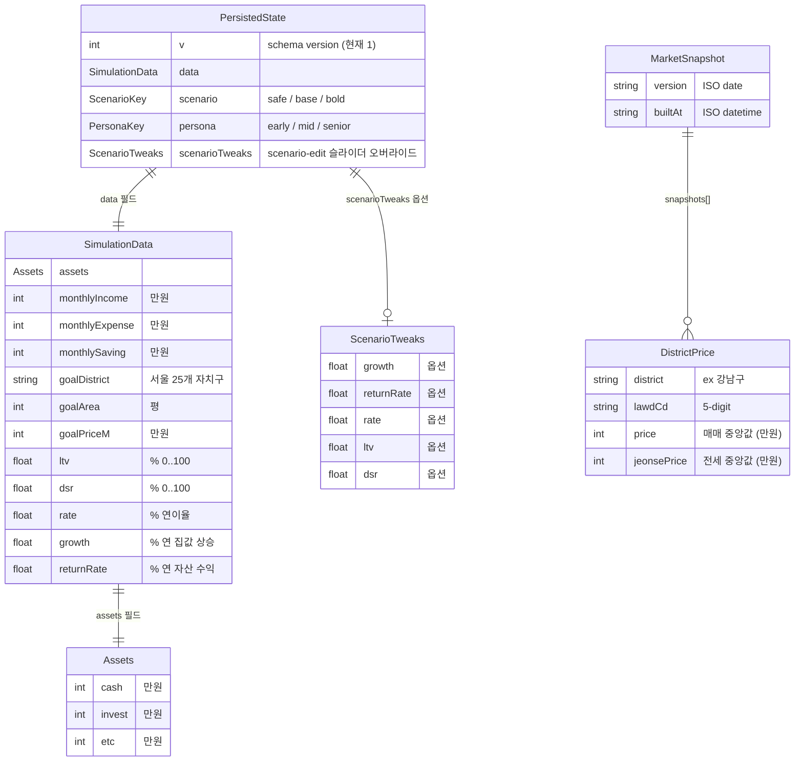

# InSeoul

서울 아파트 구매 가능 시점을 240개월 시뮬레이션으로 보여주는 **Local-First**
부동산 플래닝 웹앱. 사용자 재무 데이터는 *전부 브라우저에 머무르며*, AI
어드바이저는 로컬 Ollama 데몬 또는 브라우저 내 MediaPipe Web LLM 으로 동작한다.

---

## 1. 프로젝트 개요

### 무엇을 푸는가
"내가 지금 자산·소득·저축으로 서울 어디 몇 평을 언제쯤 살 수 있나?" — 이
질문을 외부 서비스에 데이터를 보내지 않고 답한다. 시나리오(안정/기준/적극)
별로 자산 성장과 집값 상승을 동시에 시뮬레이션해 진입 시점·월 상환액·DSR
부담을 함께 보여준다.

### 핵심 원칙
- **Local-First** — *사용자 재무 데이터* (자산·소득·저축액·목표가) 는 어떤
  외부 서버로도 전송되지 않음. 입력은 LocalStorage 에서만 산다.
- **No Sign-up / No Login**
- **On-device AI** — *추론은 모두 사용자 디바이스 내부* (Ollama 로컬 데몬 또는
  브라우저 WebGPU). OpenAI·Anthropic 같은 호스팅 LLM 서비스는 호출하지 않음.
- **Real Data** — 국토교통부 실거래가 (data.go.kr 15126474) 기반 자치구별 중앙값.

> ⚠️ **조건부 동작 — 정직하게**
> "외부 통신 0건" 이 *언제 깨지는가* 를 명시한다. 사용자 재무 데이터가 외부로
> 나가는 일은 어떤 경로에서도 없지만, 다음 *읽기 전용 다운로드* 는 발생할 수
> 있다.
> - **mediapipe 백엔드 활성화 시**: 최초 1회 MediaPipe WASM (jsdelivr CDN) +
>   모델 파일 (`VITE_GEMMA_MODEL_URL` 호스트) 다운로드. 이후 OPFS/CacheStorage 캐시.
> - **AI 시트 첫 사용 시** (모든 백엔드): `@xenova/transformers` 가 RAG 쿼리
>   임베딩용 384차원 MiniLM 모델 (~50MB) 을 HuggingFace 에서 가져옴. 이후 브라우저 캐시.
> - **ollama 백엔드 + 비-로컬 호스트**: `VITE_OLLAMA_URL` 이 localhost 가 아니면
>   사용자 입력이 해당 서버로 *전송*된다. 이 경우 AI 시트 배지가 "⚠️ 원격 LLM 사용 중"
>   (주황) 으로 자동 전환되어 노출된다 (`isLocalLlmHost()` 화이트리스트 가드).
> - **빌드 시점**: `npm run refresh:market` 은 data.go.kr 을 호출하고,
>   `npm run build:knowledge` 는 transformers.js 모델을 받는다. 둘 다 Node 전용,
>   사용자 디바이스와 무관.

### 9개 화면 흐름
welcome → wizard(5 step) → result → {golden, action, risk, calc, stepping,
scenario-edit} + AI 어드바이저 시트.

---

## 2. 시스템 아키텍처

### 단일 호스트, 무서버
백엔드가 없다. 모든 로직(시뮬레이션·RAG·LLM)은 브라우저 또는 사용자
디바이스에서 돌고, *사용자 재무 데이터를 외부로 송신하는 채널은 0개*. 다만
다음의 *읽기 전용* 외부 통신이 발생할 수 있다:

1. **정적 자산 페치** — 같은 호스트의 `public/knowledge/index.json` (빌드 타임에
   사전 계산된 RAG 인덱스), `public/data/seoul-prices.json` (실거래가 스냅샷)
2. **transformers.js 모델 다운로드** (HuggingFace, 최초 1회) — RAG 쿼리 임베딩용
3. **MediaPipe 런타임 + 모델** (jsdelivr CDN + `VITE_GEMMA_MODEL_URL`) — `mediapipe`
   백엔드 활성화 시
4. **로컬 Ollama 데몬** (`localhost:11434`, 사용자가 직접 실행) — `ollama` 백엔드 활성화 시

```text
┌─────────────────────────────────── 브라우저 ────────────────────────────────┐
│                                                                             │
│   React 19 UI ──→ lib/sim (PMT/시나리오) ──→ Zustand + LocalStorage         │
│        │                                                                    │
│        └──→ AI 시트 ──→ transformers.js (RAG 임베딩 + cosine)               │
│                  │                                                          │
└──────────────────┼──────────────────────────────────────────────────────────┘
                   │
       ┌───────────┴────────────────┐
       ▼                            ▼
┌──────────────┐         ┌──────────────────────┐
│ 정적 자산    │         │ 사용자 디바이스(선택) │
│ (빌드 산출)  │         │ Ollama Daemon        │
│ ──────────── │         │ gemma3:4b :11434     │
│ knowledge/   │         └──────────────────────┘
│  index.json  │
│ data/seoul-  │
│  prices.json │
└──────▲───────┘
       │ 빌드 시점만
       │ (Node 전용)
┌──────┴─────────────────────────────────────────┐
│  npm run refresh:market  ──HTTPS──▶ data.go.kr │
│  npm run build:knowledge ──→ knowledge index   │
└────────────────────────────────────────────────┘
```

<details>
<summary>mermaid 원본 (지원 환경에서 자동 렌더링)</summary>


</details>

### 레이어
- `src/lib/sim/` — 순수 함수 (PMT, 자산 성장, 시나리오 보정). React 의존 X.
- `src/store/` — Zustand 단일 스토어 + zod 검증 영구 envelope.
- `src/data/` — 자치구 25개 데이터 + 실거래 스냅샷 lazy 로더.
- `src/screens/` + `src/components/` — UI. iOS 26 디자인 시스템.
- `src/ai/` — RAG 검색 + 프롬프트 빌더 + LLM dispatcher (백엔드 분기).
- `src/types/contracts.ts` — 도메인 타입 단일 출처.

### 검증 게이트
- 시뮬 패리티: 3 페르소나 × 3 시나리오 = 9 스냅샷 (`lib/sim/__tests__/simulate.snap.test.ts`)
- 클라이언트 시크릿 가드: 빌드 후 `dist/` 에 `DATA_GO_KR_KEY` 흔적 0건
- e2e 프라이버시: 페이지 로드 시 third-party 네트워크 호출 0건
- 70 단위 테스트 + 10 Playwright e2e (chromium)

---

## 3. 영구 저장 스키마 (LocalStorage)

진짜 DB 는 없다. 사용자 데이터는 **LocalStorage 단일 키** (`inseoul-local-state`) 에
versioned JSON envelope 로 직렬화된다. 시장 데이터는 별도 *읽기 전용 스냅샷* 으로
서빙된다.

### ER 구조 (관계 / 엔티티)

**관계 요약** (텍스트):
- `PersistedState` 1 ─── 1 `SimulationData` (`data` 필드)
- `PersistedState` 1 ─── 0..1 `ScenarioTweaks` (옵션)
- `SimulationData` 1 ─── 1 `Assets`
- `MarketSnapshot` 1 ─── N `DistrictPrice` (`snapshots[]`)

**엔티티 — `PersistedState`** (LocalStorage 단일 키 `inseoul-local-state`)

| 필드 | 타입 | 설명 |
|---|---|---|
| `v` | int | schema version (현재 1) |
| `data` | `SimulationData` | wizard 입력값 컨테이너 |
| `scenario` | `ScenarioKey` | `safe` / `base` / `bold` |
| `persona` | `PersonaKey` | `early` / `mid` / `senior` |
| `scenarioTweaks` | `ScenarioTweaks?` | scenario-edit 슬라이더 오버라이드 (옵션) |

**엔티티 — `SimulationData`**

| 필드 | 타입 | 단위 / 비고 |
|---|---|---|
| `assets` | `Assets` | `{cash, invest, etc}` |
| `monthlyIncome` | int | 만원 |
| `monthlyExpense` | int | 만원 |
| `monthlySaving` | int | 만원 |
| `goalDistrict` | string | 서울 25개 자치구 |
| `goalArea` | int | 평 |
| `goalPriceM` | int | 만원 |
| `ltv` | float | % (0..100) |
| `dsr` | float | % (0..100) |
| `rate` | float | % 연이율 |
| `growth` | float | % 연 집값 상승 |
| `returnRate` | float | % 연 자산 수익 |

**엔티티 — `Assets`** (`cash`, `invest`, `etc`, 각각 만원 단위 int)

**엔티티 — `ScenarioTweaks`** (`growth`, `returnRate`, `rate`, `ltv`, `dsr` — 모두 옵셔널 float)

**엔티티 — `MarketSnapshot`** (`public/data/seoul-prices.json`, 빌드 산출물 — 영구 저장 X)

| 필드 | 타입 | 설명 |
|---|---|---|
| `version` | string | ISO date |
| `builtAt` | string | ISO datetime |
| `snapshots[]` | `DistrictPrice[]` | 25개 자치구 중앙값 |

**엔티티 — `DistrictPrice`**

| 필드 | 타입 | 설명 |
|---|---|---|
| `district` | string | ex 강남구 |
| `lawdCd` | string | 5-digit |
| `price` | int | 매매 중앙값 (만원) |
| `jeonsePrice` | int | 전세 중앙값 (만원) |

<details>
<summary>mermaid erDiagram 원본 (지원 환경에서 자동 렌더링)</summary>


</details>

- `PersistedState` 는 zod 스키마로 load 시점에 검증. 깨졌으면 silent null 폴백.
- `MarketSnapshot` 은 빌드 시점에 `npm run refresh:market` 으로 생성되는 *정적
  자산* — 사용자 기기에 쓰이지 않음. 미존재 시 `DISTRICT_PRICE_25` 기본값 사용.
- 영구화는 300ms debounce. `lastResult` 의 series 배열은 저장 X (재계산 < 5ms).

---

## 4. 온디바이스 LLM 시나리오

`VITE_LLM_BACKEND` 값에 따라 3 가지 백엔드로 분기. *어느 경우든 외부 LLM 서비스
(OpenAI, Anthropic 등) 는 호출되지 않음*.

| 백엔드 | 추론 위치 | 모델 | 트리거 |
|---|---|---|---|
| `ollama` | 로컬 데몬 (`:11434`) | `gemma3:4b` (3.3GB) | `VITE_LLM_BACKEND=ollama` |
| `mediapipe` | 브라우저 내 (WebGPU) | Gemma 2B IT 4-bit (.task, ~1.3GB) | `VITE_LLM_BACKEND=mediapipe` + `VITE_GEMMA_MODEL_URL` |
| `none` | — | — | 미설정 또는 명시적 `none` |

### 분기 로직

```text
AI 시트 열림
  └─ useLLM.ensureReady()
       └─ VITE_LLM_BACKEND ?
            │
            ├─ "ollama"
            │    └─ OllamaClient.ping()
            │         ├─ 200 OK              → status: ready ──┐
            │         └─ connection refused  → status: error  ─┤
            │                                                  │
            ├─ "mediapipe"                                     │
            │    └─ WebGPU 지원 ?                              │
            │         ├─ 예                                    │
            │         │   └─ 모델 .task 다운로드               │
            │         │        (OPFS / CacheStorage 캐시)      │
            │         │        ├─ 성공  → status: ready ───────┤
            │         │        └─ 실패  → status: error ───────┤
            │         └─ 아니오 → status: unsupported ─────────┤
            │                                                  │
            └─ "none" / 미설정 ───────────────────────────────┐│
                                                              ││
                                                              ▼▼
                          ready ?  ──예──→  generate (토큰 스트리밍)
                                              └─ fetch/WebGPU 실패
                                                  └─→ 템플릿 폴백
                          아니오 ──────────────────→ 템플릿 폴백
                                                    (templateAnswerFor)
```

<details>
<summary>mermaid flowchart 원본 (지원 환경에서 자동 렌더링)</summary>


</details>

### 폴백 안전망
- 어느 단계든 실패 → `src/ai/fallback/templates.ts::templateAnswerFor()` 의
  결정적 한국어 답변 사용. UI 는 "🟠 템플릿 모드" 배지 표시.
- `useAdvisor` 가 `llmState.status !== 'ready'` 분기에서 폴백 자동 처리.

### 프라이버시 가드 (Ollama 백엔드)
- `VITE_OLLAMA_URL` 호스트가 *로컬 아님* (localhost / 127.0.0.1 / [::1] / 0.0.0.0
  외) 이면 배지가 **"⚠️ 원격 LLM 사용 중"** (주황 톤) 으로 전환.
- `isLocalLlmHost()` 단위 테스트 8개로 화이트리스트 검증.

### RAG 동작
- 6개 한국어 마크다운 (`src/knowledge/docs/`) → 청크 18개 → 384차원 임베딩
  (`Xenova/paraphrase-multilingual-MiniLM-L12-v2`).
- 사용자 질문 임베딩 → cosine top-4 + 키워드 부스트.
- "추천/매수/예측" 키워드 감지 시 `risk_disclaimer.md#권유 금지` 강제 포함.

---

## 빠른 시작
1. `npm install`
2. `cp .env.example .env.local` 후 키 채우기:
   - `DATA_GO_KR_KEY` (Node 전용, 실거래가 batch 용 — 공공데이터포털 발급)
   - `VITE_LLM_BACKEND=ollama` 권장 + `ollama pull gemma3:4b`
3. `npm run build:knowledge` (RAG 인덱스 1회 빌드)
4. `npm run refresh:market` (실거래가 스냅샷, optional)
5. `npm run dev` → http://localhost:5173/

## 스크립트
- `npm run dev` / `npm run build` / `npm run preview`
- `npm run lint`
- `npm test` (Vitest 단위 128개)
- `npm run e2e` (Playwright 10개 — 사전 `npx playwright install chromium` 필요)
- `npm run build:knowledge` — `src/knowledge/docs/*.md` → `public/knowledge/index.json`
- `npm run refresh:market` — data.go.kr 호출 → `public/data/seoul-prices.json`

## 모바일 빌드 (Capacitor — Sprint 3)

InSeoul 은 iOS / Android 네이티브 앱으로도 빌드된다. 코드베이스는 단일 (Vite + React 19), Capacitor 가 WebView 로 패키징한다. 자세한 결정 근거: [ADR-S3-001](docs/adr/ADR-S3-001-cross-platform-capacitor.md).

### iOS 시뮬레이터
사전 요구: **Xcode** 설치 (App Store, Command Line Tools 만으로는 불충분).
```bash
npm run build           # dist/ 갱신
npx cap sync ios        # web → ios/App/App/public 동기화
xcodebuild -project ios/App/App.xcodeproj -scheme App -sdk iphonesimulator -configuration Debug build
# 또는 부팅된 시뮬레이터에 설치 + 실행:
npx cap run ios
```

### Android 에뮬레이터
사전 요구: **JDK 17+** (`brew install --cask temurin`) + **Android SDK** (`ANDROID_HOME` 설정).
```bash
npm run build           # dist/ 갱신
npx cap sync android    # web → android/app/src/main/assets/public 동기화
cd android && ./gradlew assembleDebug
# 또는 부팅된 에뮬레이터에 설치 + 실행:
npx cap run android
```

### 네이티브 분기
`src/App.tsx` 가 `Capacitor.isNativePlatform()` 으로 분기 — 네이티브 환경에서는 `iosFrame` 데스크톱 흉내가 자동 무력화되고 풀스크린 + safe-area-inset 모드로 전환된다. Web (chromium) 동작은 이전과 동일.

### 자동화 스크립트 (Sprint 4)
시뮬레이터/에뮬레이터에서 빌드부터 실행까지 한 번에. 호스트 환경 (Xcode 26+, JDK 17+, Android SDK + platform-tools) 이 이미 준비된 상태 가정.

```bash
# 빌드 + sync + install + launch (시뮬레이터/에뮬레이터)
npm run mobile:ios            # 첫 부팅된 iOS 시뮬레이터에 install + 실행
npm run mobile:android        # 첫 가용 AVD 부팅 + install + 실행
npm run mobile:dry:ios        # 실제 부팅 없이 명령 echo (CI/리뷰)

# console / logcat 캡처 → .planning/sprint/4/runs/{platform}-{ts}.log
npm run mobile:trace:ios
npm run mobile:trace:android

# on-device LLM 메모리 샘플링 → .planning/sprint/4/measurements/{platform}-{ts}.json
npm run mobile:mem:ios
npm run mobile:mem:android
```

자세한 옵션: `scripts/mobile-launch.sh --help`, `scripts/mobile-trace.sh --help`, `scripts/mobile-mem-measure.sh --help`.

> **메모리 측정 권장 시점**: mediapipe 추론 *도중* 측정 (cold load + first inference 가 peak). 시뮬레이터/에뮬레이터 측정값은 host RAM 공유로 실기기와 다를 수 있음 — 실기기 비교 필수.

### 실기기 빌드 (Sprint 6 — Phase B UAT)

실제 iPhone / Android 단말에 설치해 mediapipe 추론과 메모리 사용량을 검증하는 단계. 시뮬레이터/에뮬레이터 (`mobile:ios` / `mobile:android`) 와 달리 **서명 (codesign)**, **USB 권한**, **첫 실행 신뢰** 단계가 추가된다.

#### iPhone (iOS)
1. **Apple ID 로 무료 dev cert 발급**
   - Xcode 실행 → `ios/App/App.xcworkspace` 열기
   - 좌측 navigator 에서 `App` target 선택 → `Signing & Capabilities` 탭
   - `Team` 드롭다운에서 본인 Apple ID 선택 (없으면 `Add an Account...` 로 로그인 — 유료 개발자 계정 불필요, 7일 한정 personal team 으로 충분)
   - `Bundle Identifier` 가 충돌하면 뒤에 `.dev` 같은 suffix 추가
2. **USB 첫 trust + 개발자 앱 신뢰**
   - Lightning/USB-C 케이블로 Mac 에 연결 → iPhone 에 "이 컴퓨터를 신뢰하시겠습니까?" 팝업 → **신뢰**
   - Xcode Devices and Simulators (`⇧⌘2`) 에서 단말이 보이는지 확인
   - 첫 install 후 앱 실행 시 "신뢰할 수 없는 개발자" 차단 → iPhone `설정 > 일반 > VPN 및 기기 관리 > 개발자 앱` 에서 본인 Apple ID 선택 후 **신뢰**
3. **빌드 & 실행**
   ```bash
   npm run mobile:ios:device      # 연결된 실기기에 install + launch (Sprint 6 task-1)
   ```

#### Android
1. **개발자 옵션 + USB 디버깅 ON**
   - `설정 > 휴대전화 정보 > 빌드 번호` 7회 탭 → 개발자 모드 활성화
   - `설정 > 개발자 옵션 > USB 디버깅` ON
2. **adb 권한 승인**
   - USB 케이블로 PC 연결 → 단말에 "USB 디버깅을 허용하시겠습니까?" 팝업 → **허용** (이 PC 항상 허용 체크 권장)
   - 호스트에서 단말 인식 확인:
     ```bash
     adb devices       # <serial>    device  ← "device" 가 떠야 정상 (unauthorized / offline 이면 미허용)
     ```
3. **빌드 & 실행**
   ```bash
   npm run mobile:android:device  # 연결된 실기기에 install + launch (Sprint 6 task-1)
   ```

#### 흔한 막힘 → 해결책 카탈로그
첫 UAT 사용자가 자주 마주치는 4 종 (cert untrusted / USB unauthorized / mediapipe 모델 다운로드 실패 / OOM) 은 [`docs/uat-troubleshooting.md`](docs/uat-troubleshooting.md) 에 증상 → 원인 → 해결책 형태로 정리.

### 상태
- **Sprint 3** (종료): 환경 구축 + `cap sync` 통과 + 시뮬레이터/에뮬레이터 BUILD 확인 (caveat 해소).
- **Sprint 4** (종료): main 통합 + 자동화 스크립트 (launch / trace / mem) + ADR-S4-001 (검증 파이프라인).
- **이월 (Phase B UAT)**: 실기기 (iPhone/Android) 빌드 + mediapipe 모델 다운로드 + RAG 응답 + 메모리 측정. 사용자 손이 필요한 영역. 가이드: [`.planning/sprint/4/UAT-CHECKLIST.md`](.planning/sprint/4/UAT-CHECKLIST.md).

### on-device LLM 메모리 측정 (Sprint 4)

`scripts/mobile-mem-measure.sh` 가 부팅된 시뮬레이터/에뮬레이터에서 앱 프로세스의 메모리를 N회 샘플링해 JSON 으로 저장한다. 디바이스를 부팅하지 않으니 **앱이 이미 떠 있어야** 한다 (`npm run mobile:ios` / `npm run mobile:android` 선행).

```bash
# iOS 시뮬레이터 — vmmap --summary 기반, rss_mb / dirty_mb 기록
npm run mobile:mem:ios -- --samples 12 --interval 5 --label gemma2b

# Android 에뮬레이터 — adb dumpsys meminfo 기반, pss_mb / native_heap_mb 기록
npm run mobile:mem:android -- --samples 24 --interval 5 --label gemma2b
```

출력: `.planning/sprint/4/measurements/{platform}-{label or timestamp}.json`. 스키마는 `scripts/mobile-mem-measure.sh --help` 에 명시. mediapipe (tasks-genai) 가 최근 5분 unified log / logcat 에 보였다면 `mediapipe_loaded: true`.

**측정 운용 노트**
- **MediaPipe LLM 추론 도중에 측정을 시작**하라. cold load + 첫 추론이 peak 일 가능성이 높아 idle 측정만으로는 ceiling 을 못 잡는다.
- **iOS 시뮬레이터는 host RAM 공유** 라서 실기기와 차이가 크다. 절대값 회귀 기준으로 쓰지 말고, 동일 호스트 내 변화량 (label A vs B) 비교에만 활용. 실기기 비교 측정 필요.
- **Android 에뮬레이터도 동일한 caveat**. 게다가 `dumpsys meminfo` 의 EGL/Graphics 라인은 GPU 종류/드라이버에 따라 다르므로 `pss_mb` 위주로만 비교.
- 결과는 `mobile_summary` 형태로 sprint 산출물에 첨부 — 실기기 1회 + 시뮬/에뮬 baseline 1회 두 JSON 을 같이 두면 운영 판단에 충분.

## 라이선스 / 데이터 출처
- 코드: 미정 (저장소 visibility 에 따라 별도 결정)
- 실거래가: 국토교통부 / 공공데이터포털 15126474, 재배포 정책 준수
- 폰트: Pretendard (SIL OFL 1.1)
